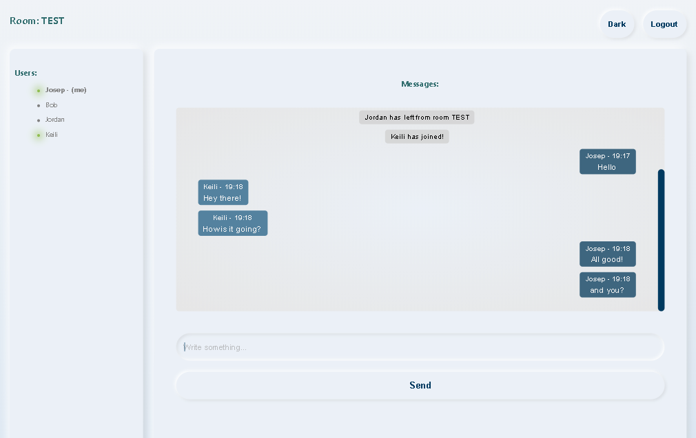
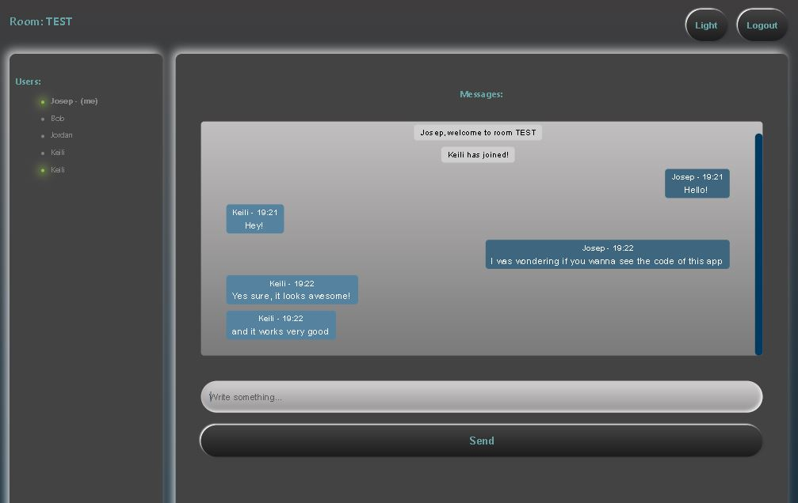

# Chattin

This App is a Full Stack project using React.js (CRA), Typescript, Sass, node, Express and Socket.io. Deployed back end on Heroku and front end on Netlify.

## Usage
It lets users to open chat rooms with a name, and start texting with other users from the chat. Unlimited number of invited users to every chat, and unlimited number of rooms.

It is styled with Sass with a soft Neumorphism design, and lets the user change to Dark Mode or Light Mode (default).

------------------------------

## Demo:
[Click here](https://chattin.netlify.app/) to use the app

-------------------------------

## Screenshots:
Light mode:

Dark mode:
